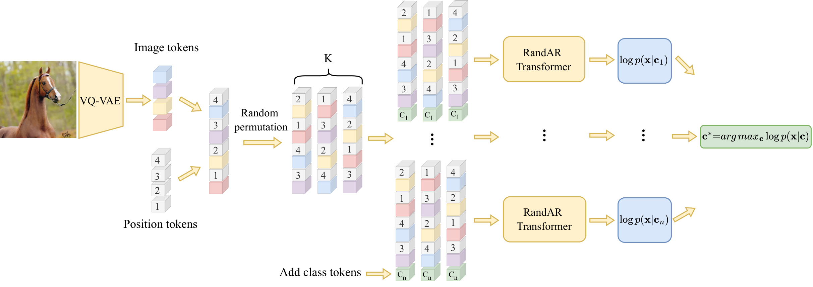

  
<div  align="center">

  

<!-- TITLE -->

# **Revisiting Autoregressive Models for Generative Image Classification**
<a href='https://arxiv.org/pdf/2603.19122v1'></a> &nbsp;

</div>

  

This is the official implementation of [Revisiting Autoregressive Models for Generative Image Classification](https://arxiv.org/abs/2603.19122v1).

<!-- DESCRIPTION -->




## Abstract 

Class-conditional generative models have emerged as accurate and robust classifiers, with diffusion models demonstrating clear advantages over other visual generative paradigms, including autoregressive (AR) models. In this work, we revisit visual AR-based generative classifiers and identify an important limitation of prior approaches: their reliance on a fixed token order, which imposes a restrictive inductive bias for image understanding. We observe that single-order predictions rely more on partial discriminative cues, while averaging over multiple token orders provides a more comprehensive signal. Based on this insight, we leverage recent any-order AR models to estimate order-marginalized predictions, unlocking the high classification potential of AR models. Our approach consistently outperforms diffusion-based classifiers across diverse image classification benchmarks, while being up to 25x more efficient. Compared to state-of-the-art self-supervised discriminative models, our method delivers competitive classification performance - a notable achievement for generative classifiers.


## Installation

1) Clone with submodules:
   ```bash
   git clone https://github.com/iasudakov/ar-classifier.git --recursive
   ```

3) Create the conda environment:
   ```bash
   conda env create -f environment.yml
   ```

## Pretrained models

To reproduce the paper results, we provide our RandAR and DiT checkpoints that were pretrained with random crop augmentation for improved classification performance: 

[](https://huggingface.co/iasudakov/ar_classifier)

## Order-marginalized AR classifier

### RandAR

```bash
torchrun  --nproc_per_node=N scripts/RandAR_classifier.py  --batch_size=125  --n_trials=20  --n_samples=2  --dataset=X  --gpt_ckpt=/path/to/gpt_ckpt  --vq_ckpt=/path/to/vq_ckpt --config=model_repositories/RandAR/configs/randar/randar_l_0.3b_llamagen.yaml  --imagenet_val_path=/path/to/imagenet/val --imagenet_X_path=/path/to/imagenet-X
```

<!-- ### LlamaGen
```bash
torchrun  --nproc_per_node=N scripts/LlamaGen_classifier.py  --batch_size=125  --n_trials=1  --n_samples=2  --dataset=X  --gpt_ckpt=/path/to/gpt_ckpt  --vq_ckpt=/path/to/vq_ckpt --config=model_repositories/RandAR/configs/randar/randar_l_0.3b_llamagen.yaml --imagenet_val_path=/path/to/imagenet/val --imagenet_X_path=/path/to/imagenet-X
``` -->


## Diffusion Classifiers

### DiT
```bash
torchrun --nproc_per_node=N scripts/DiT_classifier.py --batch_size=125  --step_size=4  --n_samples=2  --dataset=X  --dit_ckpt=/path/to/dit_ckpt  --imagenet_val_path=/path/to/imagenet/val --imagenet_X_path=/path/to/imagenet-X
```

### SiT
```bash
torchrun  --nproc_per_node=N scripts/SiT_classifier.py  --batch_size=125  --step_size=4  --n_samples=2  --dataset=X  --sit_ckpt=/path/to/sit_ckpt  --imagenet_val_path=/path/to/imagenet/val --imagenet_X_path=/path/to/imagenet-X
```


### If evaluation takes too long, consider the following options:

1. Parallelize evaluation across multiple devices ( `--nproc_per_node`).

2. Play with the evaluation strategy (`--n_trials` and `--step_size` parameters).

3. Evaluate on a smaller dataset subset. Use `--n_samples` to specify the number of images per class to classify.

  
## Citation


```bibtex
@article{sudakov2026revisiting,
      title={Revisiting Autoregressive Models for Generative Image Classification}, 
      author={Ilia Sudakov and Artem Babenko and Dmitry Baranchuk},
      year={2026},
      eprint={2603.19122},
      archivePrefix={arXiv},
      primaryClass={cs.CV},
      url={https://arxiv.org/abs/2603.19122}, 
}
```
